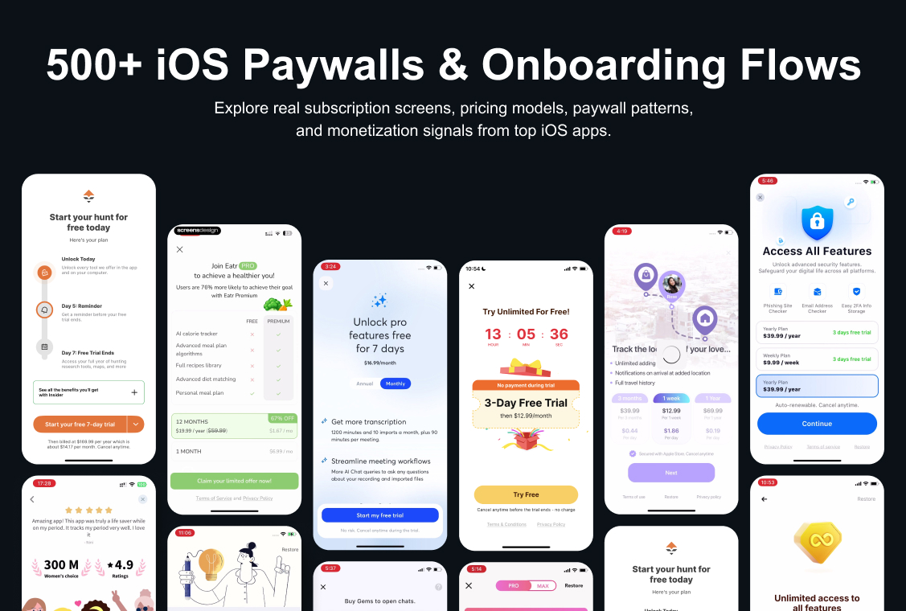

# Open Paywall Gallery

语言版本：[English](README.md) | [简体中文](README.zh-CN.md)

由 <a href="https://www.paywallpro.app/?utm_source=github&utm_medium=open_dataset&utm_campaign=paywall_gallery" target="_blank" rel="noopener noreferrer">PaywallPro</a> 发布的 Top 550 iOS 订阅 App 的付费墙与 Onboarding 公开数据集。

你可以通过这个仓库研究真实订阅 App 的付费墙截图、Onboarding 预览、定价模型、付费墙模式和部分变现数据信号。

如果你希望获得每周新增 50 个 App 的更新，欢迎 Star 这个仓库。

如果你希望我们添加某个具体 App，请提交 Issue：[请求添加 App](https://github.com/paywallpro/paywall-gallery/issues/new?template=app-request.yml)。

---



---

## 什么是 PaywallPro？

PaywallPro 是一个面向 App 开发者、产品经理、增长团队和设计师的订阅智能分析平台。

它帮助团队研究真实 iOS App 的付费墙、Onboarding 流程、定价模型、历史版本变化和变现数据信号。

PaywallPro 目前追踪：

- 46,000+ iOS 付费墙截图
- 2,000+ Onboarding 流程
- 付费墙历史版本
- 定价与试用变化
- MRR、RPD、ARPU 和订阅基准等收入信号

---

## 为什么我们做这个仓库？

订阅 App 正在快速增长，但很多团队在做付费墙和定价决策时，依然主要依赖经验、审美判断，或者孤立的 A/B 测试。

Open Paywall Gallery 希望帮助开发者在设计、开发或测试之前，先研究真实的付费墙案例。

你可以用它理解：

- 头部 App 如何呈现订阅价值
- 不同价格档位如何组织
- 免费试用如何被包装和强调
- Onboarding 如何为购买转化做铺垫
- 月付与年付方案如何建立价格锚点
- 不同品类的付费墙模式有什么差异
- 真实 App 中可以观察到哪些变现信号

---

## 关于这个仓库

`paywall-gallery` 是一个开放的 iOS App 付费墙与 Onboarding 预览数据集，以机器可读的 Markdown 文件形式发布。

它是 PaywallPro 数据库中的精选子集，设计目标是：

- 免费访问，无需注册
- 机器可读，使用结构化 frontmatter，方便程序化读取
- 易于浏览，包含人工可读的摘要和预览截图
- 适合产品研究、定价研究、UX 参考和增长分析

当前公开版本：550 个 App。后续会每周继续新增 50 个 App。

完整 App 索引位于 [apps/index.zh-CN.md](apps/index.zh-CN.md)。也可以查看英文索引 [apps/index.md](apps/index.md)。

---

## 这个仓库包含什么？

- 代表性的付费墙截图
- 可用时提供 Onboarding 预览
- 简洁的 App 案例页面
- 定价模型摘要
- 付费墙模式分类
- 部分公开的变现数据信号
- 品类索引
- 跳转到 PaywallPro 查看更多信息的链接

---

## 哪些内容保留在 PaywallPro 中？

这个仓库提供每个 App 的精选公开预览。

完整的 PaywallPro 产品包含：

- 完整付费墙截图集
- 完整 Onboarding 流程
- 所有历史付费墙版本
- 逐版本变化记录
- 改版前后的付费墙对比
- 历史定价实验
- A/B 对比参考
- 收入、MRR、RPD、ARPU 和排名信号
- 按品类、地区、定价模型和 App 类型筛选的高级能力

查看完整数据库：

<a href="https://www.paywallpro.app/?utm_source=github&utm_medium=open_dataset&utm_campaign=paywall_gallery" target="_blank" rel="noopener noreferrer">https://www.paywallpro.app</a>

---

## 数据格式

每个 App 条目位于：

```txt
apps/{app-name}-{app_id}.md
```

字段说明请查看 [Data Dictionary](docs/data-dictionary.md)。

---

## Top 20 代表性 App

| App | 品类 | 预估 MRR | 付费墙模式 | 页面 |
|---|---|---:|---|---|
| Life360: Stay Connected & Safe | Social Networking | $4.50M | Free Trial - Soft Paywall | [打开](apps/life360-stay-connected-and-safe-384830320.md) |
| Grindr - Gay Dating & Chat | Social Networking | $3.10M | No Free Trial - Soft Paywall | [打开](apps/grindr-gay-dating-and-chat-319881193.md) |
| YouTube | Photo & Video | $3.07M | No Free Trial - Soft Paywall | [打开](apps/youtube-544007664.md) |
| Google Photos: Backup & Edit | Photo & Video | $2.77M | No Free Trial - Soft Paywall | [打开](apps/google-photos-backup-and-edit-962194608.md) |
| Amazon Music: Songs & Podcasts | Music | $2.58M | Free Trial - Soft Paywall | [打开](apps/amazon-music-songs-and-podcasts-510855668.md) |
| Bumble Dating App: Meet & Date | Lifestyle | $2.57M | Credit Paywall | [打开](apps/bumble-dating-app-meet-and-date-930441707.md) |
| GameChanger | Sports | $2.54M | Free Trial - Soft Paywall | [打开](apps/gamechanger-1308415878.md) |
| X | News | $2.48M | No Free Trial - Soft Paywall | [打开](apps/x-333903271.md) |
| Telegram Messenger | Social Networking | $2.13M | No Free Trial - Soft Paywall | [打开](apps/telegram-messenger-686449807.md) |
| Dropbox: Cloud Storage Backup | Productivity | $2.09M | Free Trial - Soft Paywall | [打开](apps/dropbox-cloud-storage-backup-327630330.md) |
| NFL | Sports | $2.04M | No Free Trial - Soft Paywall | [打开](apps/nfl-389781154.md) |
| SoundCloud: The Music You Love | Music | $1.71M | No Free Trial - Soft Paywall | [打开](apps/soundcloud-the-music-you-love-336353151.md) |
| BIGO LIVE-Live Stream, Go Live | Social Networking | $1.65M | No Free Trial - Soft Paywall | [打开](apps/bigo-live-live-stream-go-live-1077137248.md) |
| NYTimes: US and Global News | News | $1.48M | No Free Trial - Soft Paywall | [打开](apps/nytimes-us-and-global-news-284862083.md) |
| FaceApp: Perfect Face Editor | Photo & Video | $1.45M | Free Trial - Soft Paywall | [打开](apps/faceapp-perfect-face-editor-1180884341.md) |
| Wyze - Never Wonder | Lifestyle | $1.45M | Free Trial - Soft Paywall | [打开](apps/wyze-never-wonder-1288415553.md) |
| MileIQ: Mileage Tracker & Log | Finance | $1.26M | Free Trial - Soft Paywall | [打开](apps/mileiq-mileage-tracker-and-log-578830929.md) |
| Lingokids: Games & Shows | Education | $1.16M | No Free Trial - Soft Paywall | [打开](apps/lingokids-games-and-shows-1002043426.md) |
| Quizlet: More than Flashcards | Education | $1.16M | Free Trial - Soft Paywall | [打开](apps/quizlet-more-than-flashcards-546473125.md) |
| TIDAL Music: HiFi Sound | Music | $1.03M | Free Trial - Soft Paywall | [打开](apps/tidal-music-hifi-sound-913943275.md) |

完整 App 索引位于 [apps/index.zh-CN.md](apps/index.zh-CN.md)。

---

## 按品类浏览

- [Social Networking](categories/social-networking.md)
- [Photo & Video](categories/photo-video.md)
- [Music](categories/music.md)
- [Lifestyle](categories/lifestyle.md)
- [Sports](categories/sports.md)
- [News](categories/news.md)
- [Productivity](categories/productivity.md)
- [Finance](categories/finance.md)
- [Education](categories/education.md)
- [Health & Fitness](categories/health-and-fitness.md)
- [Business](categories/business.md)
- [Medical](categories/medical.md)
- [Utilities](categories/utilities.md)
- [Entertainment](categories/entertainment.md)
- [Travel](categories/travel.md)
- [Reference](categories/reference.md)
- [Food & Drink](categories/food-and-drink.md)
- [Shopping](categories/shopping.md)
- [Books](categories/books.md)
- [Navigation](categories/navigation.md)
- [Weather](categories/weather.md)
- [Graphics & Design](categories/graphics-and-design.md)
- [Games](categories/games.md)

---

## 按付费墙模式浏览

- [Free Trial Paywalls](docs/free-trial-paywalls.md)
- [Monthly vs Annual Pricing](docs/monthly-vs-annual-pricing.md)
- [Paywall Pattern Taxonomy](docs/paywall-pattern-taxonomy.md)

---

## 即将支持

我们正在探索将这个数据集做成 Skills 版本，让开发者、产品经理和增长团队可以在工作流中直接调用真实付费墙案例作为参考。

未来可以直接提出类似问题：

- 给我 10 个健身类 App 的免费试用付费墙
- 对比生产力 App 的月付和年付定价
- 找出 Onboarding 后接软付费墙的案例

---

## 适合哪些使用场景？

对独立开发者：

- 在上线订阅 App 前查找定价参考
- 学习头部 App 如何解释订阅价值
- 对比免费试用与非试用付费墙结构

对产品经理：

- Benchmark 不同品类的付费墙模式
- 为付费墙改版准备参考案例
- 理解竞品如何组织套餐和权益

对增长团队：

- 分析价格锚点
- 研究试用期呈现方式
- 寻找付费墙 A/B 测试方向

对设计师：

- 研究布局、视觉层级、套餐卡片、CTA 和权益表达方式
- 建立订阅 UX 参考库

---

## 路线图

- v0.1.0 - Top 500 Public Review Release
- Weekly Drop #1 - 新增 50 个 App
- Weekly Drop #2 - 新增 50 个 App
- 品类索引页
- 付费墙模式索引页
- 每周持续扩展
- 基于 GitHub Actions 的自动更新流水线

---

## 贡献

发现值得记录的付费墙？发现数据错误？

请查看 [CONTRIBUTING.zh-CN.md](CONTRIBUTING.zh-CN.md)。

请查看 [REQUESTS.zh-CN.md](REQUESTS.zh-CN.md) 了解当前请求列表。

---

## License 和使用说明

本仓库中的结构化元数据可用于学习、研究、评论和内部产品参考，使用时请注明出处。

你不能批量复制、重新包装、转售这些数据，或使用该数据集构建商业化竞品付费墙情报产品。

截图和 UI 版权归各自 App 开发者所有。完整条款请查看 [LICENSE](LICENSE)。

---

## Powered by PaywallPro

Open Paywall Gallery 由 PaywallPro 发布。

PaywallPro 帮助订阅 App 团队研究头部 iOS App 的付费墙、Onboarding 流程、定价模型、历史变化和变现数据信号。
