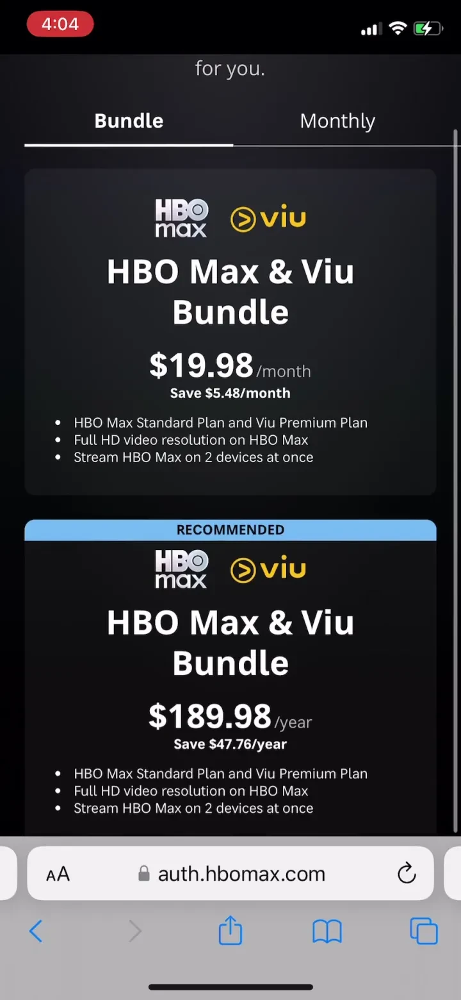
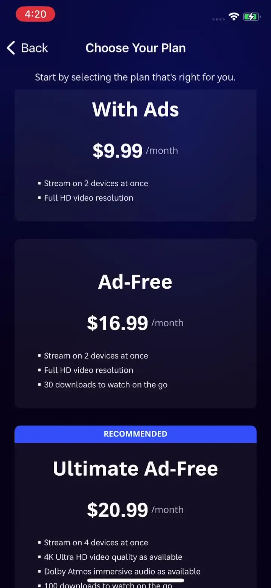

# HBO Max: Stream Movies & TV

## Snapshot

HBO Max: Stream Movies & TV is an Entertainment app by WarnerMedia Global Digital Services, LLC. This compact preview highlights representative iOS subscription paywall screens from the US storefront. The full PaywallPro page includes the complete screenshot set, version history, onboarding context, and deeper revenue signals.

## Key Takeaways

- HBO Max: Stream Movies & TV uses the No Free Trial - Soft Paywall pattern in the Entertainment category.
- The preview exposes one visible offer set; the full PaywallPro page may include more historical context.
- The paywall presents month, year options to support price anchoring.

## Featured Paywall

  

## Screenshots

| Paywall screen 2 | Paywall screen 3 |
|---|---|
|  |  |

## Paywall Pattern

| Field | Value |
|---|---|
| Category | Entertainment |
| Paywall type | No Free Trial - Soft Paywall |
| Pricing model | 1 offer set across month, year |
| Captured version | 5.2.0 |
| Version release date | 2024-12-09 |

## Pricing

| Offer | Month | Year |
|---|---:|---:|
| Offer 1 | $9.99/$16.99/$20.99 | $99.99/$169.99/$209.99 |

## Metrics

| Metric | Value |
|---|---:|
| App Store rating | 4.87 |
| Category rank | #3 |
| MRR estimate | $19.00M |
| Avg daily revenue | $1.23M |
| Avg daily downloads | 36.40K |
| Avg daily ARPU | $33.80 |

## View More

See the full paywall history, screenshots, onboarding flow, and revenue insights on [PaywallPro](https://www.paywallpro.app/apps/hbo-max-stream-movies-and-tv?id=1666653815&utm_source=github&utm_medium=open_dataset&utm_campaign=paywall_gallery).

---

Powered by [PaywallPro](https://www.paywallpro.app).
