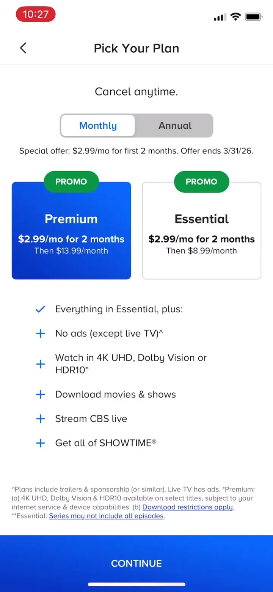

# Paramount+

## Snapshot

Paramount+ is an Entertainment app by CBS Interactive. This compact preview highlights representative iOS subscription paywall screens from the US storefront. The full PaywallPro page includes the complete screenshot set, version history, onboarding context, and deeper revenue signals.

## Key Takeaways

- Paramount+ uses the Free Trial - Soft Paywall pattern in the Entertainment category.
- 2 distinct offer sets are visible in this capture, useful for comparing tiering or pricing variants.
- The paywall presents month, year options to support price anchoring.

## Screenshots

  
  
  

## Paywall Pattern

| Field | Value |
|---|---|
| Category | Entertainment |
| Paywall type | Free Trial - Soft Paywall |
| Pricing model | 2 offer sets across month, year |
| Captured version | 15.0.22 |
| Version release date | 2024-07-29 |

## Pricing

| Offer | Month | Year |
|---|---:|---:|
| Offer 1 | $5.99/$11.99 | $59.99/$119.99 |
| Offer 2 | $5.99 | Not shown |

## Metrics

| Metric | Value |
|---|---:|
| App Store rating | 4.62 |
| Category rank | #13 |
| MRR estimate | $13.34M |
| Avg daily revenue | $410.32K |
| Avg daily downloads | 18.76K |
| Avg daily ARPU | $21.88 |

## View More

See the full paywall history, screenshots, onboarding flow, and revenue insights on [PaywallPro](https://www.paywallpro.app/apps/paramount?id=530168168&utm_source=github&utm_medium=open_dataset&utm_campaign=paywall_gallery).

---

Powered by [PaywallPro](https://www.paywallpro.app).
