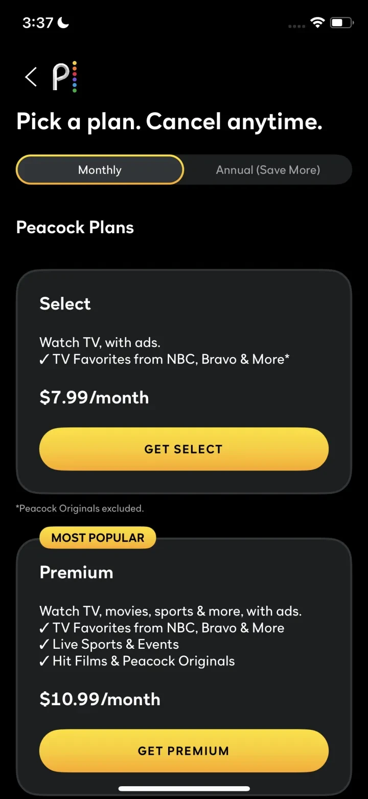

# Peacock TV: Stream TV & Movies

  

## Snapshot

Peacock TV: Stream TV & Movies is an Entertainment app by Peacock TV LLC. This preview shows one representative iOS subscription paywall from the US storefront. The full PaywallPro page includes the complete screenshot set, version history, onboarding context, and deeper revenue signals.

## Paywall Pattern

| Field | Value |
|---|---|
| Category | Entertainment |
| Paywall type | No Free Trial - Soft Paywall |
| Pricing | $7.99/$10.99/$16.99/month \| $79.99/$109.99/$169.99/year |
| Captured version | 6.9.32 |
| Version release date | 2025-10-07 |

## In-App Purchases

| Period | Price |
|---|---:|
| month | $7.99/$10.99/$16.99 |
| year | $79.99/$109.99/$169.99 |

## Metrics

| Metric | Value |
|---|---:|
| App Store rating | 4.66 |
| Category rank | #2 |
| MRR estimate | $24.85M |
| Avg daily revenue | $923.05K |
| Avg daily downloads | 23.42K |
| Avg daily ARPU | $39.42 |

## View More

See the full paywall history, screenshots, onboarding flow, and revenue insights on [PaywallPro](https://www.paywallpro.app/apps/peacock-tv-stream-tv-and-movies?id=1508186374&utm_source=github&utm_medium=open_dataset&utm_campaign=paywall_gallery).

---

Powered by [PaywallPro](https://www.paywallpro.app).
