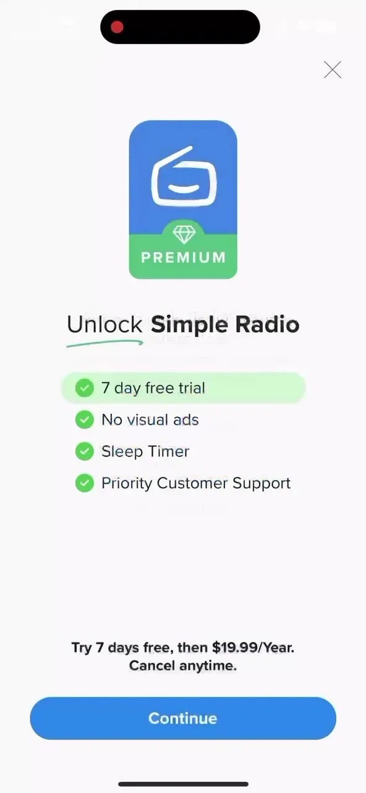
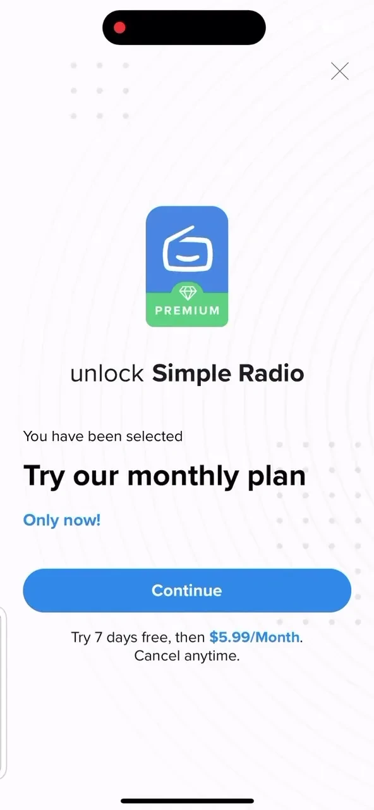
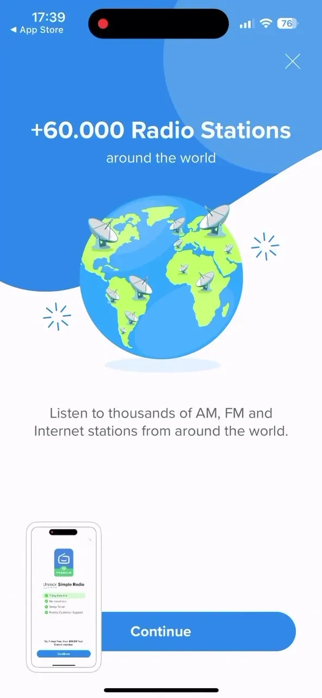

# Simple Radio - FM AM Stations Paywall Analysis

Category: Music
Estimated MRR: $33.67K
Paywall Pattern: Free Trial - Soft Paywall
Pricing Model: 2 offer sets across week, year
Captured Version: 8.3.2
Version Release Date: 2024-07-29

View full case on PaywallPro:
<a href="https://www.paywallpro.app/apps/Simple-Radio---FM-AM-Stations-us?id=8585&utm_source=github&utm_medium=open_dataset&utm_campaign=paywall_gallery" target="_blank" rel="noopener noreferrer">Open full case on PaywallPro</a>

## Snapshot

Simple Radio - FM AM Stations is a Music app by Streema, Inc.. This compact public preview highlights representative iOS subscription paywall screens from the US storefront.

Its paywall is a useful reference for studying how apps in the Music category present subscription value, structure pricing, use trials, and reduce purchase friction.

The full PaywallPro page includes the complete screenshot set, version history, onboarding context, and deeper revenue signals.

## Key Takeaways

- Simple Radio - FM AM Stations uses the Free Trial - Soft Paywall pattern in the Music category.
- 2 distinct offer set(s) are visible in this capture, making it useful for comparing pricing variants, plan structure, or tiering strategy.
- The paywall presents week, year option(s), which can help reveal how the app uses price anchoring and subscription framing.
- The pricing structure shows how a leading Music app packages subscription value for its users.

## Why This Paywall Matters

Paywalls in the Music category need to communicate value quickly and make the subscription decision easy to understand.

This Simple Radio - FM AM Stations paywall is worth studying because it shows how a real subscription app combines offer framing, pricing structure, visual hierarchy, and purchase flow into one conversion experience.

For app builders, product managers, growth teams, and designers, this case can be used as a reference when researching pricing, trial strategy, subscription UX, or paywall redesign ideas.

## Screenshots

  
  
  

## Paywall Pattern

| Field | Value |
|---|---|
| Category | Music |
| Paywall type | Free Trial - Soft Paywall |
| Pricing model | 2 offer sets across week, year |
| Captured version | 8.3.2 |
| Version release date | 2024-07-29 |

This paywall uses the **Free Trial - Soft Paywall** structure.

This pattern is useful for studying how the app presents subscription value, reduces purchase hesitation, and guides users toward a paid plan.

## Pricing Structure

| Offer | Week | Year |
|---|---:|---:|
| Offer 1 | Not shown | $19.99 |
| Offer 2 | $5.99 | Not shown |

## Monetization Signals

| Metric | Value |
|---|---:|
| App Store rating | 4.72 |
| Category rank | #30 |
| Estimated MRR | $33.67K |
| Avg daily revenue | $1.22K |
| Avg daily downloads | 1.59K |
| Avg daily ARPU | $0.77 |
| Onboarding preview count | 5 |
| Walkthrough preview count | 0 |
| Full history available on PaywallPro | Yes |

## What Builders Can Learn

- How Simple Radio - FM AM Stations frames subscription value for users in the Music category.
- How the app structures pricing options and subscription periods.
- How the paywall uses visual hierarchy to guide the purchase decision.
- How trials, discounts, or offer sets are used to reduce purchase friction.
- How this paywall can inspire pricing, UX, or A/B testing ideas for similar apps.

## Questions to Explore

- Which plan or offer is visually prioritized?
- Does the paywall lead with value, price, trial, urgency, or social proof?
- Is the annual plan positioned as the best-value option?
- How much cognitive load does the pricing section create?
- What would you test if you were optimizing this paywall?
- How does this paywall compare with other apps in the Music category?

## View More

This is a limited public preview.

For the full paywall history, complete screenshot set, onboarding flow, historical changes, pricing experiments, and deeper revenue analysis, visit:

<a href="https://www.paywallpro.app/apps/Simple-Radio---FM-AM-Stations-us?id=8585&utm_source=github&utm_medium=open_dataset&utm_campaign=paywall_gallery" target="_blank" rel="noopener noreferrer">PaywallPro</a>

---

Powered by PaywallPro.
