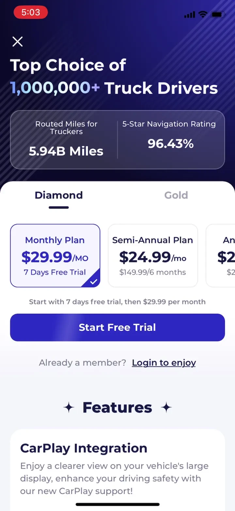
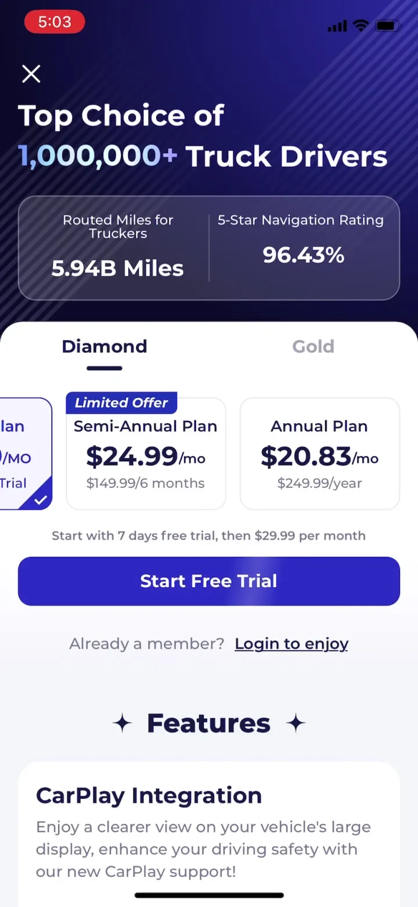
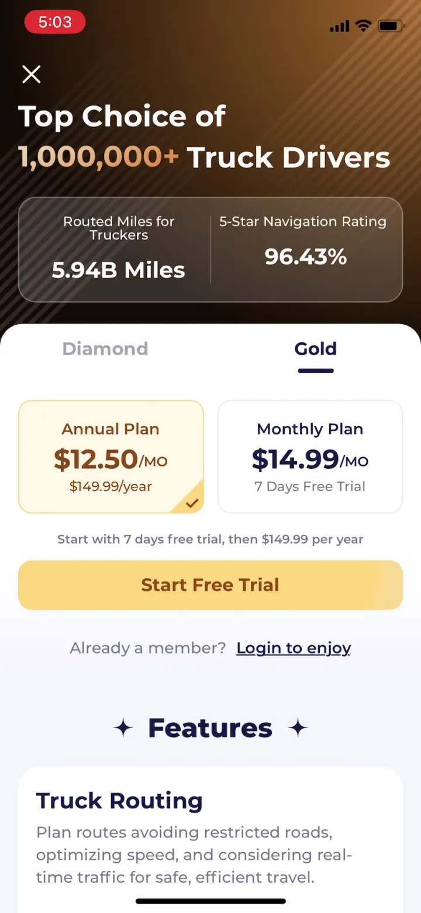

# Trucker Path: Truck GPS & Fuel Paywall Analysis

Category: Navigation
Estimated MRR: $50.58K
Paywall Pattern: Free Trial - Soft Paywall
Pricing Model: 1 offer set across month, half year, year
Captured Version: 6.8.2
Version Release Date: 2025-11-08

View full case on PaywallPro:
<a href="https://www.paywallpro.app/apps/Trucker-Path:-Truck-GPS-&-Fuel-us?id=120&utm_source=github&utm_medium=open_dataset&utm_campaign=paywall_gallery" target="_blank" rel="noopener noreferrer">Open full case on PaywallPro</a>

## Snapshot

Trucker Path: Truck GPS & Fuel is a Navigation app by Trucker Path Inc.. This compact public preview highlights representative iOS subscription paywall screens from the US storefront.

Its paywall is a useful reference for studying how apps in the Navigation category present subscription value, structure pricing, use trials, and reduce purchase friction.

The full PaywallPro page includes the complete screenshot set, version history, onboarding context, and deeper revenue signals.

## Key Takeaways

- Trucker Path: Truck GPS & Fuel uses the Free Trial - Soft Paywall pattern in the Navigation category.
- The preview exposes one visible offer set; the full PaywallPro page may include more historical context.
- The paywall presents month, half year, year option(s), which can help reveal how the app uses price anchoring and subscription framing.
- The pricing structure shows how a leading Navigation app packages subscription value for its users.

## Why This Paywall Matters

Paywalls in the Navigation category need to communicate value quickly and make the subscription decision easy to understand.

This Trucker Path: Truck GPS & Fuel paywall is worth studying because it shows how a real subscription app combines offer framing, pricing structure, visual hierarchy, and purchase flow into one conversion experience.

For app builders, product managers, growth teams, and designers, this case can be used as a reference when researching pricing, trial strategy, subscription UX, or paywall redesign ideas.

## Screenshots

  
  
  

## Paywall Pattern

| Field | Value |
|---|---|
| Category | Navigation |
| Paywall type | Free Trial - Soft Paywall |
| Pricing model | 1 offer set across month, half year, year |
| Captured version | 6.8.2 |
| Version release date | 2025-11-08 |

This paywall uses the **Free Trial - Soft Paywall** structure.

This pattern is useful for studying how the app presents subscription value, reduces purchase hesitation, and guides users toward a paid plan.

## Pricing Structure

| Offer | Month | Half Year | Year |
|---|---:|---:|---:|
| Offer 1 | $29.99/$14.99 | $149.99 | $249.99/$149.99 |

## Monetization Signals

| Metric | Value |
|---|---:|
| App Store rating | 4.79 |
| Category rank | #45 |
| Estimated MRR | $50.58K |
| Avg daily revenue | $45.42K |
| Avg daily downloads | 1.20K |
| Avg daily ARPU | $37.75 |
| Onboarding preview count | 9 |
| Walkthrough preview count | 5 |
| Full history available on PaywallPro | Yes |

## What Builders Can Learn

- How Trucker Path: Truck GPS & Fuel frames subscription value for users in the Navigation category.
- How the app structures pricing options and subscription periods.
- How the paywall uses visual hierarchy to guide the purchase decision.
- How trials, discounts, or offer sets are used to reduce purchase friction.
- How this paywall can inspire pricing, UX, or A/B testing ideas for similar apps.

## Questions to Explore

- Which plan or offer is visually prioritized?
- Does the paywall lead with value, price, trial, urgency, or social proof?
- Is the annual plan positioned as the best-value option?
- How much cognitive load does the pricing section create?
- What would you test if you were optimizing this paywall?
- How does this paywall compare with other apps in the Navigation category?

## View More

This is a limited public preview.

For the full paywall history, complete screenshot set, onboarding flow, historical changes, pricing experiments, and deeper revenue analysis, visit:

<a href="https://www.paywallpro.app/apps/Trucker-Path:-Truck-GPS-&-Fuel-us?id=120&utm_source=github&utm_medium=open_dataset&utm_campaign=paywall_gallery" target="_blank" rel="noopener noreferrer">PaywallPro</a>

---

Powered by PaywallPro.
