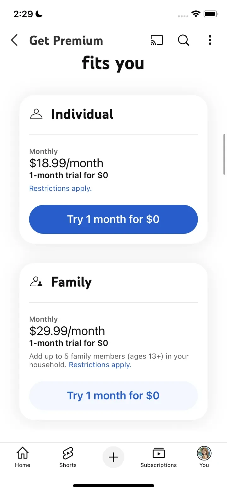

# YouTube

## Snapshot

YouTube is a Photo & Video app by Google. This compact preview highlights representative iOS subscription paywall screens from the US storefront. The full PaywallPro page includes the complete screenshot set, version history, onboarding context, and deeper revenue signals.

## Key Takeaways

- YouTube uses the Free Trial - Soft Paywall pattern in the Photo & Video category.
- 2 distinct offer sets are visible in this capture, useful for comparing tiering or pricing variants.

## Screenshots

  
  

## Paywall Pattern

| Field | Value |
|---|---|
| Category | Photo & Video |
| Paywall type | Free Trial - Soft Paywall |
| Pricing model | 2 offer sets across month |
| Captured version | 20.40.4 |
| Version release date | 2025-10-06 |

## Pricing

| Offer | Month |
|---|---:|
| Offer 1 | $18.99 |
| Offer 2 | $18.99/$29.99 |

## Metrics

| Metric | Value |
|---|---:|
| App Store rating | 4.68 |
| Category rank | #1 |
| MRR estimate | $55.84M |
| Avg daily revenue | $2.21M |
| Avg daily downloads | 46.31K |
| Avg daily ARPU | $47.79 |

## View More

See the full paywall history, screenshots, onboarding flow, and revenue insights on [PaywallPro](https://www.paywallpro.app/apps/youtube?id=544007664&utm_source=github&utm_medium=open_dataset&utm_campaign=paywall_gallery).

---

Powered by [PaywallPro](https://www.paywallpro.app).
